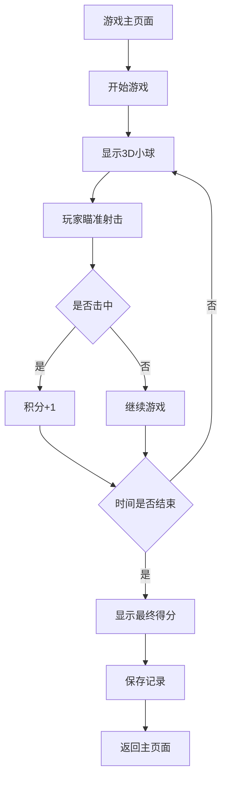

## 1. 产品概述
这是一个基于Web的AimLab简化版射击训练游戏，使用React和3D技术实现。玩家通过控制屏幕中心的十字准星点击移动的小球来进行瞄准训练，提升反应速度和精准度。

目标用户为FPS游戏爱好者和想要提升瞄准能力的玩家，产品价值在于提供便捷的在线瞄准训练工具。

## 2. 核心功能

### 2.1 用户角色
| 角色 | 注册方式 | 核心权限 |
|------|----------|----------|
| 访客用户 | 无需注册 | 使用所有游戏功能、查看本地记录 |

### 2.2 功能模块
游戏包含以下主要页面：
1. **游戏主页面**：3D游戏场景、小球射击、十字准星控制、积分显示、倒计时
2. **设置页面**：游戏参数配置、准星样式设置、小球属性设置
3. **成绩页面**：历史记录、最佳成绩、统计数据

### 2.3 页面详情
| 页面名称 | 模块名称 | 功能描述 |
|----------|----------|----------|
| 游戏主页面 | 3D游戏场景 | 渲染3D环境，显示小球和背景 |
| 游戏主页面 | 射击系统 | 检测鼠标点击，判断是否击中目标 |
| 游戏主页面 | 积分系统 | 记录击破小球数量，实时更新得分 |
| 游戏主页面 | 倒计时器 | 60秒游戏时间，结束后显示最终得分 |
| 游戏主页面 | 十字准星 | 跟随鼠标移动，显示瞄准点 |
| 设置页面 | 小球设置 | 设置颜色、大小、密集程度、移动速度 |
| 设置页面 | 准星设置 | 设置颜色、大小、粗细 |
| 设置页面 | 游戏模式 | 选择固定/移动/随机移动模式 |
| 成绩页面 | 历史记录 | 显示最近10次游戏成绩 |
| 成绩页面 | 最佳成绩 | 显示最高分和最佳连击数 |

## 3. 核心流程
玩家进入游戏后可以立即开始训练，无需注册登录。游戏开始后，玩家通过移动鼠标控制十字准星瞄准屏幕上出现的3D小球，点击鼠标左键进行射击。每击中一个小球获得1分，游戏时长60秒，时间结束后显示最终得分并记录到本地存储。

## 4. 用户界面设计

### 4.1 设计风格
- **主色调**：深蓝色渐变背景（#1a1a2e到#16213e）
- **辅助色**：霓虹蓝（#00d4ff）、荧光绿（#00ff88）、橙色（#ff6b35）
- **按钮风格**：圆角矩形，悬停发光效果
- **字体**：Orbitron、Roboto Mono等科技感字体
- **布局风格**：全屏沉浸式，顶部状态栏，中央游戏区域
- **图标风格**：简约线条图标，配合发光效果

### 4.2 页面设计概述
| 页面名称 | 模块名称 | UI元素 |
|----------|----------|----------|
| 游戏主页面 | 3D场景 | 深色星空背景，3D小球带有发光效果，击中时爆炸粒子特效 |
| 游戏主页面 | 状态栏 | 顶部显示当前得分、剩余时间、最佳记录，使用霓虹蓝文字 |
| 游戏主页面 | 十字准星 | 可自定义的中心瞄准点，支持不同颜色和粗细 |
| 设置页面 | 控制面板 | 半透明黑色面板，滑块和开关控制各项参数 |
| 成绩页面 | 数据展示 | 卡片式布局显示各项统计数据，使用渐变色彩 |

### 4.3 响应式设计
采用桌面优先设计，主要面向PC端玩家。支持1080p和2K分辨率，鼠标操作为主。移动端提供基础适配，但推荐使用PC端获得最佳体验。