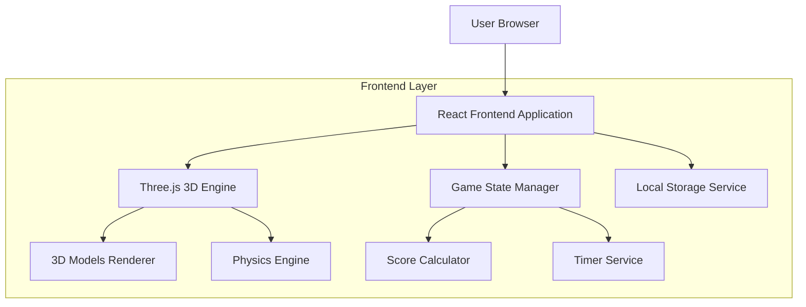
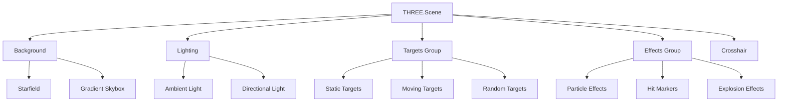

## 1. 架构设计



## 2. 技术描述
- **前端**: React@18 + Three.js@0.158 + Vite
- **初始化工具**: vite-init
- **包管理器**: pnpm
- **3D渲染**: Three.js用于3D小球和场景渲染
- **状态管理**: React Hooks (useState, useEffect, useRef)
- **本地存储**: 浏览器LocalStorage保存游戏记录和设置

## 3. 路由定义
| 路由 | 用途 |
|-------|---------|
| / | 游戏主页面，显示3D游戏场景 |
| /settings | 设置页面，配置游戏参数和外观 |
| /scores | 成绩页面，查看历史记录和统计数据 |

## 4. 核心组件架构

### 4.1 主要组件结构
```typescript
// 游戏主组件
interface GameComponent {
  scene: THREE.Scene;
  camera: THREE.PerspectiveCamera;
  renderer: THREE.WebGLRenderer;
  targets: Target[];
  crosshair: Crosshair;
  score: number;
  timeLeft: number;
  gameMode: GameMode;
}

// 3D小球接口
interface Target {
  mesh: THREE.Mesh;
  position: THREE.Vector3;
  velocity: THREE.Vector3;
  size: number;
  color: string;
  isMoving: boolean;
  destroyed: boolean;
}

// 十字准星接口
interface Crosshair {
  color: string;
  size: number;
  thickness: number;
  position: THREE.Vector2;
}

// 游戏设置接口
interface GameSettings {
  targetColor: string;
  targetSize: number;
  spawnDensity: number;
  crosshairColor: string;
  crosshairSize: number;
  crosshairThickness: number;
  gameMode: 'fixed' | 'mixed' | 'random';
  moveSpeed: number;
}
```

### 4.2 游戏状态管理
```typescript
// 游戏状态枚举
enum GameState {
  IDLE = 'idle',
  PLAYING = 'playing',
  PAUSED = 'paused',
  FINISHED = 'finished'
}

// 游戏模式枚举
enum GameMode {
  FIXED = 'fixed',
  MIXED = 'mixed',
  RANDOM = 'random'
}

// 游戏数据接口
interface GameData {
  currentScore: number;
  bestScore: number;
  totalHits: number;
  totalShots: number;
  accuracy: number;
  gameHistory: GameSession[];
}

// 游戏会话接口
interface GameSession {
  id: string;
  score: number;
  hits: number;
  shots: number;
  accuracy: number;
  duration: number;
  timestamp: number;
}
```

## 5. 3D场景架构

### 5.1 场景层次结构


### 5.2 核心3D类定义
```typescript
// 3D目标管理器
class TargetManager {
  private scene: THREE.Scene;
  private targets: Target[];
  private spawnTimer: number;
  
  constructor(scene: THREE.Scene);
  spawnTarget(settings: GameSettings): Target;
  updateTargets(deltaTime: number): void;
  checkHit(raycaster: THREE.Raycaster): Target | null;
  removeTarget(target: Target): void;
}

// 十字准星管理器
class CrosshairManager {
  private element: HTMLElement;
  private settings: CrosshairSettings;
  
  constructor(container: HTMLElement);
  updatePosition(mouseX: number, mouseY: number): void;
  updateStyle(settings: CrosshairSettings): void;
  show(): void;
  hide(): void;
}

// 粒子效果管理器
class ParticleManager {
  private scene: THREE.Scene;
  private particles: THREE.Points[];
  
  constructor(scene: THREE.Scene);
  createExplosion(position: THREE.Vector3, color: string): void;
  createHitMarker(position: THREE.Vector3): void;
  update(deltaTime: number): void;
}
```

## 6. 游戏逻辑实现

### 6.1 游戏循环
```typescript
// 主游戏循环
class GameLoop {
  private isRunning: boolean;
  private lastTime: number;
  private updateCallback: (deltaTime: number) => void;
  private renderCallback: () => void;
  
  start(): void;
  stop(): void;
  update(currentTime: number): void;
}

// 射击检测系统
class ShootingSystem {
  private camera: THREE.PerspectiveCamera;
  private raycaster: THREE.Raycaster;
  private mouse: THREE.Vector2;
  
  constructor(camera: THREE.PerspectiveCamera);
  checkHit(targets: Target[]): Target | null;
  updateMousePosition(x: number, y: number): void;
}
```

### 6.2 本地存储服务
```typescript
// 本地存储管理器
class LocalStorageService {
  private key: string = 'aimlab_data';
  
  saveGameData(data: GameData): void;
  loadGameData(): GameData | null;
  saveSettings(settings: GameSettings): void;
  loadSettings(): GameSettings | null;
  clearData(): void;
}
```

## 7. 性能优化策略

### 7.1 3D渲染优化
- 使用对象池复用小球对象，减少创建销毁开销
- 实现视锥体剔除，只渲染可见目标
- 使用LOD（细节层次）技术，远距离目标使用低精度模型
- 粒子效果使用GPU加速的Points渲染

### 7.2 内存管理
- 及时清理不再使用的3D对象和材质
- 使用WeakMap管理临时对象引用
- 实现纹理缓存机制，避免重复加载

### 7.3 帧率优化
- 使用requestAnimationFrame进行游戏循环
- 实现自适应渲染质量，根据帧率动态调整
- 使用Web Workers处理复杂计算，避免阻塞主线程